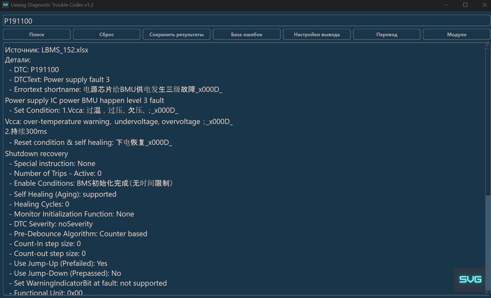
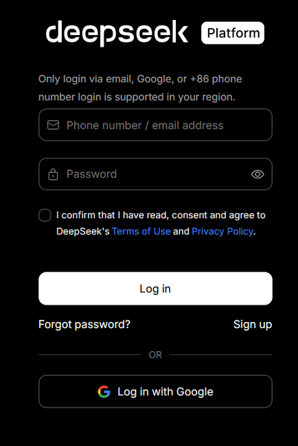
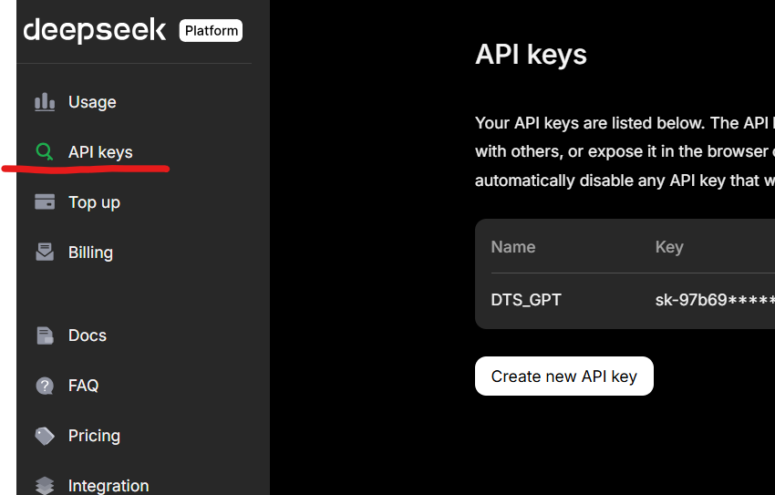

# Lixiang Diagnostic Trouble Codes_DTC
Отсутствие оффициального диллера китайской автомобильной компании Liauto в России и большого количества ввезенных на территорию машин, а так же остуствие легального ПО для диагностики и отстуствия желания китайских коллег в оказании помощи, сподвигло меня на написание данной программы после глобального изучения данного авто в части реализации процессов диагностики Lixiang. Программа будет полезна автосервисам, а так же пользователям данного авто.
# Интерфейс программы

# Инструкция по работе с программой

Эта программа предназначена для расшифровки полученных кодов ошибок (DTC) после проведения диагностики автомобилей Lixiang 6,7,8,9, перевода их описания на русский, английский язык с помощью DeepSeek и удобной работы с результатами, а так же ознакомиться с названиями модулей и за что он отвечает.

# Требования

- Windows 7,8,10,11
- Разархивируй файл DTC.zip на рабочий стол, должна появиться папка DTC
- Для реализации перевода текста кода ошибок на русский, английский язык, если это необходимо, зарегистрироваться на сайте [Deepseek.com](https://platform.deepseek.com/sign_in)

- войдя в личный кабинет deepseek.com выбери в меню раздел APi keys [Личный кабинет](https://platform.deepseek.com/api_keys)

- создай свой ключ АPI нажав на кнопку Create new API keys, скопируй его и сохрани в надежном месте :)
- переводчик бесплатный но требует закинуть на счет миниму 20 юаней если првила не поменялись на сегодня
- использование ключа, при нажатии кнопки "Перевод" появиться окно для ввода ключа 

ввести ключ и программа его сохранит в папке программы и и создаст файл `api_key.txt`, при дальнейшем использовании ввод ключа не потребуется.

# Запуск программы

1. Перейди в папку с программой c:\Users\Имя компьютера\Desktop\DTC.
2. Запусти программу DTC_Lixiang_v1.3.exe.
3. Появится окно программы с заголовком **"Lixiang Diagnostic Trouble Codes"**.

# Управление

<table>
  <thead>
    <tr>
      <th width="20%">Кнопка</th>
      <th width="15%">Горячая клавиша</th>
      <th width="65%">Функция</th>
    </tr>
  </thead>
  <tbody>
    <tr>
      <td><b>🔍 Поиск (Search)</b></td>
      <td align="center"><code>Enter</code></td>
      <td>Запускает сканирование базы данных по введенному коду.</td>
    </tr>
    <tr>
      <td><b>🔄 Сброс (Reset)</b></td>
      <td align="center"><code>Ctrl+R</code></td>
      <td>Очищает поле вывода результатов и сбрасывает текущий поиск.</td>
    </tr>
    <tr>
      <td><b>💾 Сохранить (Save)</b></td>
      <td align="center"><code>Ctrl+S</code></td>
      <td>Сохраняет текущие результаты поиска (и перевода) в текстовый файл .txt.</td>
    </tr>
    <tr>
      <td><b>📂 База ошибок</b></td>
      <td align="center">-</td>
      <td>Позволяет выбрать папку, в которой хранятся файлы диагностических кодов не важно от какого авто.</td>
    </tr>
    <tr>
      <td><b>⚙️ Настройки вывода</b></td>
      <td align="center">-</td>
      <td>Открывает диалог выбора модулей для отображения в результатах.</td>
    </tr>
    <tr>
      <td><b>🌐 Перевод</b></td>
      <td align="center"><code>Ctrl+T</code></td>
      <td>Отправляет текст в AI.</td>
    </tr>
    <tr>
      <td><b>📋 Модули</b></td>
      <td align="center"><code>Ctrl+M</code></td>
      <td>Открывает встроенный справочник аббревиатур модулей (ECU).</td>
    </tr>
    <tr>
      <td><b>🎨 Тема</b></td>
      <td align="center">-</td>
      <td>Переключает между цветовыми темами интерфейса: Nord, Dark, Light, Original.</td>
    </tr>
    <tr>
      <td><b>🔤 Язык</b></td>
      <td align="center"><code>Ctrl+L</code></td>
      <td>Меняет язык интерфейса (русский / английский).</td>
    </tr>
    <tr>
      <td><b>💖 Донат</b></td>
      <td align="center">-</td>
      <td>Поддержать разработку проекта — чашка кофе для автора ❤️</td>
    </tr>
  </tbody>
</table>

# Работа с программой

### 1. Поиск ошибки

1. Введи код ошибки в поле ввода, например, `P191100`.
   - **Важно**: Ввод возможен только на английской раскладке.
2. Нажми кнопку **"Поиск"**.
3. В поле результатов появится информация об ошибке из файлов базы, например:
   ```
   Источник файла: LBMS_77.xlsx
   Детали:
     - DTC: P191100
     - DTCText: Power supply fault 3
     ...
   =======================================
   ```

### 2. Перевод описания

1. После поиска нажми кнопку **Перевод**.
   - Если API-ключ не задан, появится окно для его ввода. Введи ключ и нажми "ОК".
2. Программа подключится к AI и переведёт описание ошибки на русский и английский. Результат добавится в поле результатов ниже:
   ```
   Подключение к ChatGPT... (Время: 12:34:56)
   Перевод завершён. Время выполнения: 32.10 секунд.
   =======================================
   LBMS_77.xlsx
   Лист1
   Детали:
     - DTC: P191100
     - DTCText: Неисправность питания 3
     ...
   =======================================
   ```
   - **Важно**: скорость перевода зависит от качества вашего Интернета и загрузки сервера перевода в данный момент, если возникают ошибки, повторяйте еще раз.
3. После перевода появится окно с тремя кнопками:
   - **"ОК"**: Предложит выбрать место для сохранения.
   - **"Открыть"**: Сохранить результат в файл (например, `P191100_2025-03-17.txt`) рядом с программой и открыть его в текстовом редакторе
   - **"Копировать"**: Сохранить результат в файл и скопировать сам файл в буфер обмена для вставки (например, в Telegram).

### 3. Сохранение результатов

1. Нажми кнопку **"Сохранить результаты"**.
2. В диалоге выбери имя файла (по умолчанию предлагается `<код_ошибки>_<дата>.txt`, например, `P191100_2025-03-17.txt`) и папку.
3. Нажми "Сохранить". Весь текст из поля результатов сохранится в файл.

# Полезные советы

- API-ключ сохраняется в `api_key.txt` после первого ввода — повторно вводить не придётся.
- Для отправки файла в Telegram: после нажатия "Копировать" вставь файл в чат (Ctrl+V) — он отправится как `P191100_2025-03-17.txt`.

# Возможные ошибки

- **"Нет результатов для сохранения"**: Выполни поиск перед сохранением.
- **"Не удалось загрузить API ключ"**: Проверь наличие файла `api_key.txt` в папке с программой DTC_GPT.exe или введи ключ заново.
- **Файл не открывается**: Убедись, что текстовый редактор установлен по умолчанию.

# Контакты

- если есть предложения по работе программы или выявлены ошибки при работе программы, обращайся в Telegram  **[@svg62](https://t.me/svg62) Владимир**

